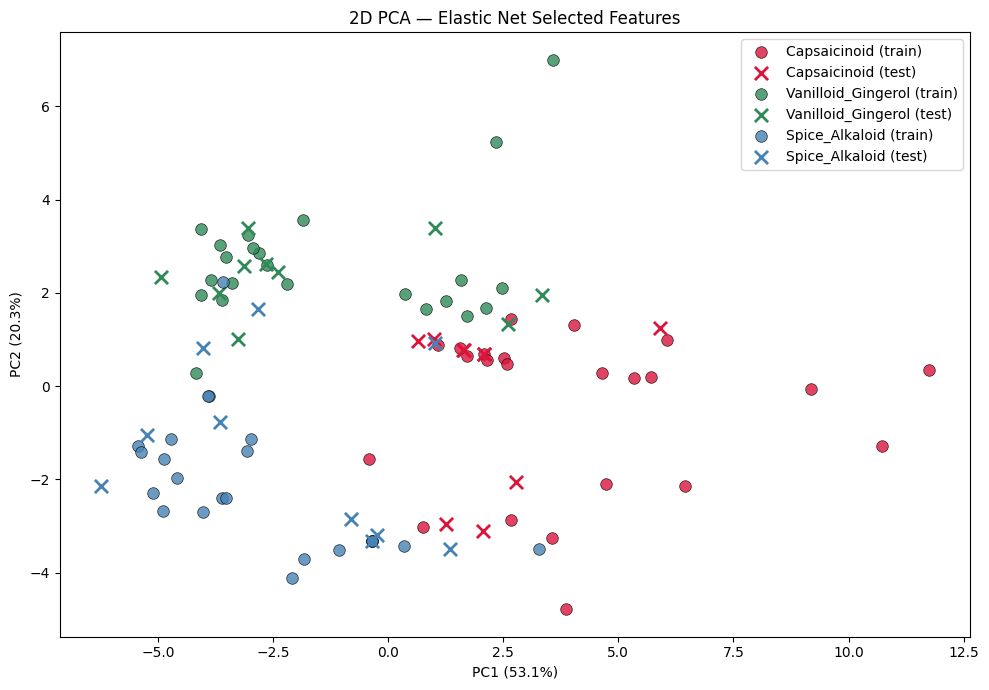

# Capsaicinoid Compound Classification

**Author:** Dongwan Kim

This project classifies 99 capsaicinoid-related compounds into three chemical families using 165 RDKit molecular descriptors. Because the dataset has more features than samples, the main challenge is not building a complex model, but selecting a compact and discriminative feature set without leaking information from the test set.

The central design choice is to use **supervised feature selection with Elastic Net logistic regression** before classification. PCA is still used for 2D visualization, but not as the classifier input, because PCA is unsupervised and does not use class labels. Elastic Net reduces the descriptor table from 165 features to 30 selected features, after which compact classical classifiers are sufficient for strong test-set performance.

---

## Motivation

This project is meant to make one modeling point clearly: in a small molecular dataset, feature selection matters more than model complexity. The workflow therefore emphasizes a leakage-safe split, Elastic Net feature selection on the training set only, and compact classical classifiers rather than a large model search.

---

## Dataset

- **99 molecules** with class labels curated from PubChem, balanced across 3 families (33 compounds each):
  - **Class 0 — Capsaicinoids** (Capsaicin, Dihydrocapsaicin, Nonivamide, Resiniferatoxin, …)
  - **Class 1 — Vanilloids / Gingerols** (6-Gingerol, 6-Shogaol, Zingerone, Vanillin, Eugenol, …)
  - **Class 2 — Spice Alkaloids** (Piperine, Piperlongumine, Chavicine, Capsazepine, …)
- **165 RDKit molecular descriptors** after removing high-NaN and zero-variance columns.
- **Stratified 70 / 30 train / test split** with `random_state=42` (69 train / 30 test, 23 train / 10 test per class).

---

## Pipeline

### 01 — Data Collection (`01_data_collection.ipynb`)

- Fetches IsomericSMILES for the 99 compounds via the PubChem PUG REST API.
- Converts SMILES to RDKit `Mol` objects and computes the full set of ~200 2D molecular descriptors.
- Drops columns with > 10% NaN, fills the remainder with 0, and removes zero-variance columns.
- Saves the cleaned dataset to `data/molecules.csv` (99 compounds × 165 features + 3 metadata columns).

### 02 — EDA, Leakage-Safe Elastic Net Feature Selection, and PCA Visualization (`02_EDA_and_PCA.ipynb`)

- Class distribution bar chart (balanced: 33 per class).
- Correlation heatmap of the top 20 high-variance descriptors — confirms strong redundancy among molecular-size features (`MolWt`, `ExactMolWt`, `HeavyAtomMolWt`, `LabuteASA`, `MolMR`).
- Per-class boxplots of the top 5 high-variance descriptors — `Ipc` shows visible class separation in EDA, while several molecular-weight descriptors appear redundant. This motivates supervised feature selection rather than relying on visual separation alone.
- **Stratified 70 / 30 train/test split** performed **before** any preprocessing.
- **Elastic Net logistic regression** used as the supervised feature-selection step. A small grid over `l1_ratio` and `C` is fit on the (scaled) training data. The chosen configuration **`C = 0.1`, `l1_ratio = 0.7`** reduces **165 -> 30 features (~82% reduction)** while preserving class-discriminative signal.
- `StandardScaler` is then re-fit on the **training subset of the selected 30 features only** and applied to the test set.
- 2D PCA is used **only as a visual diagnostic** of the selected feature space, not as a modeling input.
- Saves a single artifact `data/model_input_elasticnet.joblib` with the scaled train/test arrays, labels, selected feature names, and Elastic Net hyperparameters for the downstream notebook.



### 03 — Classical ML Classification (`03_classical_ml_classifier.ipynb`)

- Loads the Elastic Net–selected feature artifact directly (no re-fitting of preprocessing — keeps the pipeline leakage-safe).
- Compares three compact classical classifiers, all using `class_weight="balanced"`:
  - **Logistic Regression** — interpretable linear baseline (default `C = 1.0`).
  - **Linear SVM** — margin-based linear classifier (`C = 0.2`).
  - **RBF SVM** — one non-linear baseline (`C = 3.0`, `gamma="scale"`).
- Reports 5-fold stratified cross-validation on the training set with `accuracy`, `balanced_accuracy`, and `macro_f1` as a stability check before held-out test evaluation.
- Evaluates each model on the held-out test set with accuracy, balanced accuracy, macro F1, a confusion matrix, and a per-class classification report.
- Saves a combined CSV (`data/classical_ml_results.csv`) with CV and test metrics for all three models, sorted by `test_macro_f1`.

---

## Final model

**RBF SVM (C = 3.0, gamma = "scale", class_weight = "balanced")** on the 30 Elastic Net–selected descriptors.

The two linear models (Logistic Regression and Linear SVM) reach the same test accuracy and make very similar errors, which indicates that most of the Elastic Net–selected feature space is already mostly linearly separable. The RBF SVM then captures a small amount of additional non-linear structure, which is enough to cleanly recover the Vanilloid / Gingerol class and to give the strongest overall scores in the final comparison table. The remaining errors concentrate on the Spice Alkaloid class, which is the most chemically heterogeneous of the three families.

This ordering is intentional: linear baselines first, then RBF as the only non-linear addition. With only 69 training samples, the goal is to demonstrate the value of the feature-selection step rather than to chase performance with a large model search.

---

## Key takeaway

> **The supervised feature-selection step is the most important modeling decision in this project.**
>
> - PCA alone is unsupervised and discards label information, so it preserves variance rather than class separability.
> - Elastic Net logistic regression uses the labels, produces a sparse and stable subset under correlated descriptors, and turns a 99-sample / 165-feature p > n problem into a 99-sample / 30-feature problem that classical classifiers can handle confidently.
> - Once a compact, discriminative feature subset exists, model choice becomes a secondary, smaller-impact decision.

---

## How to reproduce

Run the notebooks in order; each one writes the artifacts that the next one reads.

```bash
conda env create -f environment.yml
conda activate capsaicinoid-ml

jupyter notebook 01_data_collection.ipynb
jupyter notebook 02_EDA_and_PCA.ipynb
jupyter notebook 03_classical_ml_classifier.ipynb
```

All random seeds are fixed (`random_state = 42`) so the train/test split, CV folds, and model fits are reproducible.

---


## Tech stack

- **Data collection:** PubChem PUG REST API, RDKit (`Chem`, `Descriptors`, `MoleculeDescriptors`)
- **EDA / preprocessing:** pandas, NumPy, matplotlib, seaborn
- **Feature selection:** scikit-learn Elastic Net `LogisticRegression` (`penalty="elasticnet"`, `solver="saga"`)
- **Modeling:** scikit-learn `LogisticRegression`, `SVC` (linear and RBF kernels), `StratifiedKFold`, `cross_validate`
- **Evaluation:** `accuracy_score`, `balanced_accuracy_score`, `f1_score (macro)`, `confusion_matrix`, `ConfusionMatrixDisplay`, `classification_report`
- **Persistence:** `joblib`

---

## Notes and scope

This is an intentionally compact project. Feature engineering specific to cheminformatics (for example: Morgan fingerprints, Tanimoto similarity) and aggressive hyperparameter search were left out so that the focus stays on the impact of supervised feature selection in a small, balanced, multiclass setting. The classifier section is restricted to compact linear and kernel baselines for the same reason.

---

## Data source

Compound names and SMILES are retrieved from the public PubChem PUG REST API. Molecular descriptors are computed locally with RDKit.
